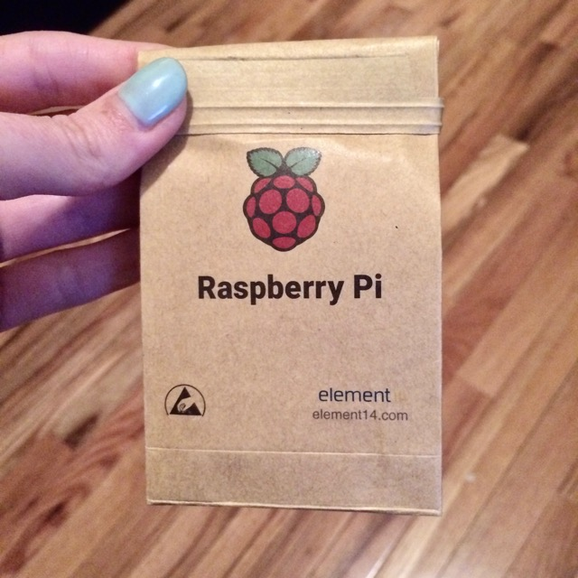
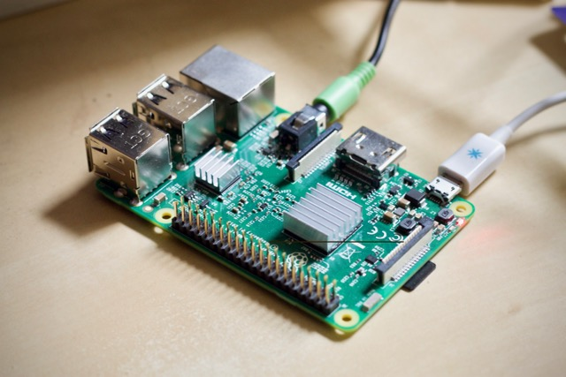
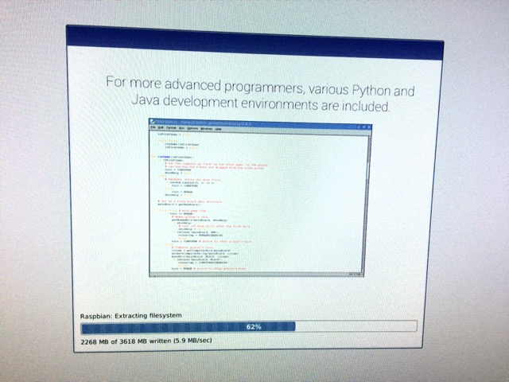
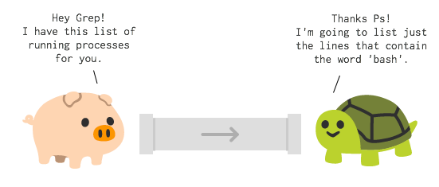

# Machine diary #00 - setup and first interpreter

When planning this project, Mariko and I decided on two constants - the base machine specs, and the programming language. We agreed to both write everything in JavaScript, on a [Raspberry Pi 2](https://www.raspberrypi.org/).

The operating system distribution was entirely up to the individual. I've always had success with the [NOOBS](https://www.raspberrypi.org/downloads/noobs/) package, so that was my go-to this time around as well.

I took the Pi out of the adorable paper bag it was packaged in, and proceeded to install Linux on a 32GB capacity micro SD card.







I set up Linux to boot into console mode only, without the OS [GUI](http://www.linfo.org/gui.html). This is because for my machine, I set the goal of writing and running code on the command line only. A lofty and naive goal, I'm sure it'll turn out to be!

Once everything was installed and booted, I proceeded to install the essential software I needed, such as [NodeJS](https://nodejs.org/) (I chose v6 LTS), [git](https://git-scm.com/), ssh keys, etc. I figured I could use [vi](https://www.howtogeek.com/102468/a-beginners-guide-to-editing-text-files-with-vi/) or [nano](https://www.howtogeek.com/howto/42980/the-beginners-guide-to-nano-the-linux-command-line-text-editor/) as my code editor, which are not normally my first choice, but that was my doing given I am working without a GUI.

I then assigned the Pi a static IP address on my local network. This makes it easy for me to [secure shell](https://en.wikipedia.org/wiki/Secure_Shell) into the Pi, and develop code from my main laptop, a MacBook Pro. I don't have any need to interface directly with the machine, and this means I can still conduct research, read online documentation, and multi-task while working with the Pi. If I were using a GUI, I would have opted for using something like [VNC](https://en.wikipedia.org/wiki/Virtual_Network_Computing) from my laptop instead. Having a command line only machine made this setup lightweight - I only needed my preferred terminal app to code on the Pi.

The first "part" or component of my machine that I wanted to create was a very simple but powerful one. It's a recreation of unix's [cat](https://en.wikipedia.org/wiki/Cat_%28Unix%29) command in NodeJS. `cat` can take a file, and dump it to the [standard output](http://www.linfo.org/standard_output.html) of the command line. Although handy for inspecting file content, this seems a little useless on its own. The real power is when you combine it with unix pipes. Unix pipes, denoted by the `|` symbol, allow you to chain together several pieces of functionality in succession. The following unix command, for example, will list all current bash processes running:

```bash
ps | grep bash
```

We "piped" the output of the [ps](https://en.wikipedia.org/wiki/Ps_(Unix)) command into the [grep](https://en.wikipedia.org/wiki/Grep) command, effectively setting it as the input for `grep` to work its magic on.



Pipes are so cool! It took me a while to understand them, how they work, and how powerful they are, but I use unix pipes on a regular basis these days.

Pipes are supported in NodeJS within the [Streams API](https://nodejs.org/api/stream.html#stream_readable_pipe_destination_options).

The most basic way to use pipes in NodeJS is to write a line of code which will take the [standard input](http://www.linfo.org/standard_input.html) and dump it to the [standard output](http://www.linfo.org/standard_input.html). The output in this case is the command line itself, and the input could be keypresses, the contents of a file, or something else. It looks like this:

```javascript
#!/usr/bin/env node

process.stdin.pipe(process.stdout);

```

To write `cat` though, I need to allow an argument to go with the command. This argument will be the path to the file that we're asking to `cat`. I can use `process.avgv` for this. The first argument in this object is `node`, the second is the node file I'm running (`cat.js`), and the third is the filepath that is to be typed in last.

The result I was looking for is below. Notice that I aimed to also drop the `node` command at the beginning:

```bash
./cat.js /path/to/my/file.txt
```

And this is the final code:

```javascript
#!/usr/bin/env node

const fs = require('fs');
const path = require('path');

// if there is no third argument, there's a missing filepath
if (process.argv.length < 3) return console.error('please supply a file to cat!');

const filepath = process.argv[2];

// create a readable stream of the file
const source = fs.createReadStream(filepath);

source.on('error', (error) => {
  return console.error('could not read file: ', error);
});

// start piping the file stream to standard output
source.pipe(process.stdout);
```

I don't really have a use for all of the options that the real `cat` command offers, so I omitted them.

To make the file executable (so that I can run it without typing out `node` first), I ran the following unix command:

```bash
chmod +x cat.js
```


And that's the first "part" of my machine! I imagine this part will get a lot of use for the next few parts that I code.